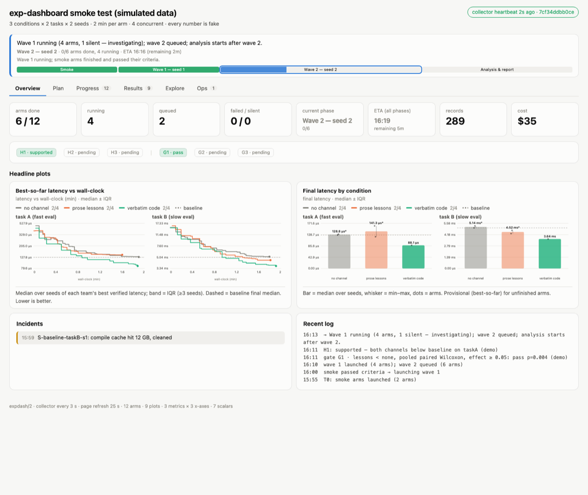
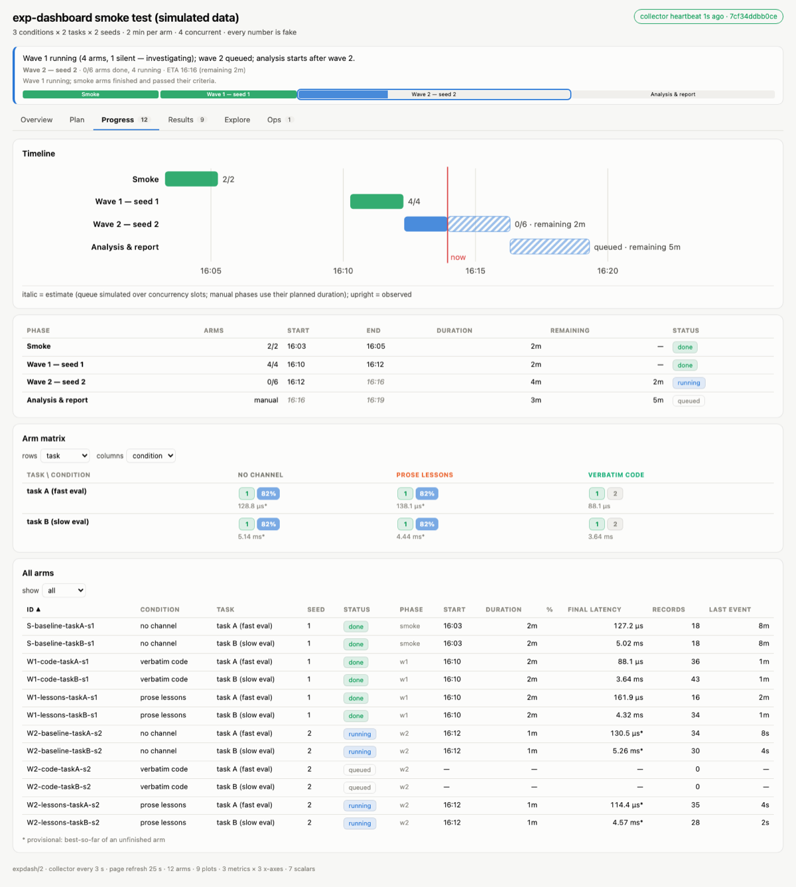
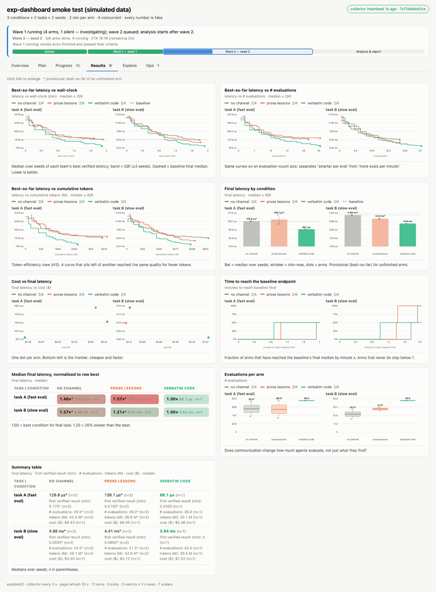

# exp-dashboard

**A skill that turns an experiment plan into a live, tabbed dashboard — so you watch a web page instead of a terminal.**

You (or your coding agent) write the plan; the agent drops in a 30-line data adapter; from then on the
campaign runs itself onto one HTML page: what the experiment is, where it is right now, when each phase
will finish, and every declared metric drawn against every declared x-axis while the data is still coming in.

Built for agent-run research campaigns (many arms × conditions × seeds, hours to days, remote machines),
but the data model is generic: anything that produces records over time fits.

<p align="center"></p>

## What the page does

| tab | contents |
|---|---|
| **Overview** | heartbeat, "what is happening now" banner, phase strip, tiles (done / running / silent / queued / ETA / cost), headline plots, hypotheses & gates, latest incidents and log |
| **Plan** | the plan text (markdown), hypotheses with predictions and verdicts, factors and levels, budget, every phase as an expandable card (purpose · method · criteria · outputs · planned vs actual), what is measured |
| **Progress** | Gantt timeline with observed (solid) vs estimated (hatched) bars and a *now* line, per-phase ETA table, arm matrix (pick any two factors for rows/columns), sortable/filterable arm table; click any arm for its details |
| **Results** | all declared plots: curves (median ± IQR / mean ± sd / individual arms), bars, boxes, scatter, CDFs, heatmaps, tables; click a title to enlarge; click a legend entry to hide a group |
| **Explore** | combine any metric × x-axis × group × facet × aggregation on the fly; the view is encoded in the URL hash |
| **Ops** | GPU / core occupancy, disk, load, anchor drift, incidents, silent arms with their data paths, log, collector info |

Time estimates update on every refresh: running arms end at `start + budget`, queued arms are packed onto
`concurrency` slots, manual phases use their planned duration, and durations are learned from finished arms
when no budget is declared. Estimates are italic; observations upright; provisional numbers are starred.

<p align="center"></p>
<p align="center"></p>

## Quickstart (fake campaign, 90 seconds)

```bash
git clone https://github.com/xuanfeiren/exp-dashboard.git
cd exp-dashboard
scripts/smoke_test.sh /tmp/expdash-smoke 8399 60     # simulate → collect → serve → screenshot every tab
open http://localhost:8399                            # or look at /tmp/expdash-smoke/shot_*.png
```

## Using it as an agent skill

The repo *is* a [Claude Code skill](https://docs.anthropic.com/en/docs/claude-code/skills) (also usable
with any agent that reads `SKILL.md`):

```bash
git clone https://github.com/xuanfeiren/exp-dashboard.git ~/.claude/skills/exp-dashboard
# or: npx skills add xuanfeiren/exp-dashboard
```

Then, after the agent has written an experiment plan, say "put this on a dashboard" (or just launch —
the skill's description triggers on experiment campaigns). `SKILL.md` walks the agent through:
plan.json → adapter → liveness check → detached collector → page → screenshot check → narrate through
`logline.py` → snapshot at the end.

## How it works

```
data host                              laptop                         browser
runs/… ──► collector.py ──► live.json ──scp──► ~/<name>-dashboard/ ──► index.html
plan.json, state.json     (every 30 s)         serve.sh / hub-serve.sh      (refetch every 25 s)
```

1. **`plan.json`** — the contract (see [`templates/plan.example.json`](templates/plan.example.json)):
   `factors` (independent variables incl. replicates) → `arms`; `phases` with `est_min`, `depends_on`,
   purpose/method/criteria/outputs; `metrics` (per-record series: `best_so_far` | `raw` | `cumsum`),
   `x_axes` (`minutes`, `evals`, `step`, or any numeric field), `scalars` (one number per arm, derived
   or adapter-provided), `plots`, `hypotheses`, `gates`, `baseline`.
2. **`collector.py`** runs where the data is. It calls the adapter for every arm, builds every
   metric × x-axis curve, derives scalars, infers status (queued / running / silent / done / failed),
   rolls up phases, flags mass silence (N arms dying in the same minute = credentials / host), merges
   the hand-written `state.json`, and writes `live.json` atomically. `--check` proves it can see data
   before you trust it.
3. **Adapters** (`adapters/`) are the only experiment-specific code: `collect_arm(arm, plan, ctx) →
   {records, scalars, status, start, end, progress, note, src}`. Bundled: JSON-lines events, CSV
   rows, regex over log files, multi-lane teams.
4. **`dashboard.html`** is one file, vanilla JS + inline SVG, no CDN, no build. It works from
   `python3 -m http.server` on an air-gapped box and can be frozen into a single snapshot.
5. **`logline.py`** is how the agent narrates: `log`, `now_doing`, `phase <id> running|done`,
   `gate <name> pass|fail`, `hypothesis <id> supported|refuted`, `incident warn|error`.

Schemas: [`reference/live-schema.md`](reference/live-schema.md), [`reference/plot-spec.md`](reference/plot-spec.md).

## Plot types

| type | needs | shows |
|---|---|---|
| `curve` | metric `y`, x-axis `x`, optional `group`, `facet`, `agg` ∈ median_iqr / mean_sd / lanes | step or line curves per group; band; dashed baseline final; running arms extend to now |
| `bar` / `box` | scalar `y`, `group`, optional `facet` | median (or mean) with whiskers and per-arm dots / quartile boxes |
| `scatter` | scalars `x`, `y`, `color` factor | one dot per arm; provisional arms hollow |
| `cdf` | scalar `y` (e.g. time-to-threshold), `group` | fraction of arms below x; arms that never reach it keep the curve below 1 |
| `heatmap` | scalar `value`, factors `rows`, `cols`, `normalize: row_best` | ratio to best-in-row with colour |
| `table` | scalars `values`, `rows`, `cols` | medians with n |

## Hard-won operating rules

Distilled from months of multi-day agent campaigns (details in [`reference/ops-lessons.md`](reference/ops-lessons.md)):

- a monitor must prove it sees data before anyone trusts it (`--check`, printed `src`);
- live data often lives somewhere else than final data (scratch dirs wiped on reboot) — adapters read both;
- show heartbeat age in red when stale; flag silent arms; flag N arms going silent in the same minute;
- orchestration and collection live on the data host; the laptop only pulls and displays;
- all conditions on every figure, `n` next to every aggregate, italic estimates, starred provisional values;
- detach with `setsid nohup … < /dev/null &`; kill by exact command line; copy scripts, don't paste them through ssh.

## Layout

```
SKILL.md                 agent instructions (the skill)
templates/               plan.example.json · collector.py · dashboard.html · serve.sh · hub.html · hub-serve.sh
adapters/                jsonl_events.py · csv_rows.py · log_regex.py · multi_lane.py
scripts/                 simulate.py · smoke_test.sh · logline.py · snapshot.py
reference/               live-schema.md · plot-spec.md · ops-lessons.md · design-guide.md
docs/                    screenshots
```

## License

MIT
